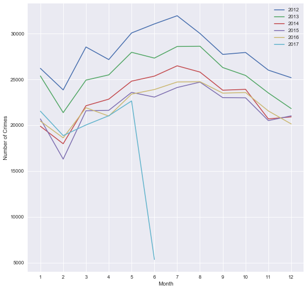
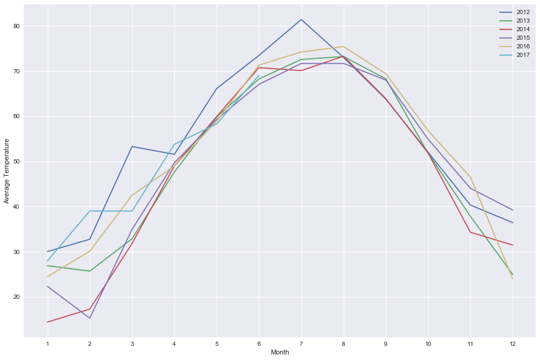

# 
Does a hot summer mean more crime? How the Tribune conducted the analysis

## 
Introduction

The purpose of this analysis is to parse and understand the relationship between temperature and crime in Chicago. The Tribune analyzed historical crime data from the City of Chicago and temperature data from the Midwestern Regional Climate Center to identify when crimes peak and which types of crimes tend to occur more frequently as temperature rises.

## 
 Methodology

### Data collection:

The Tribune collected Chicago Police crime data from Jan. 1, 2012 to June 7, 2017 from [City of Chicago Data Portal](https://data.cityofchicago.org/Public-Safety/Crimes-2001-to-present/ijzp-q8t2). The Tribune gathered average daily temperature for Chicago from the [Midwestern Regional Climate Center](http://mrcc.isws.illinois.edu/) for the same time range. You can see the data [here](https://github.com/mallaham/tribune-projects/tree/master/Crime-Weather-Analysis/crimeData) and [here](https://github.com/mallaham/tribune-projects/blob/master/Crime-Weather-Analysis/climate_Data_Jan_1_2012_up_to_Jun_7_2017.csv).

### Data processing:

In the first round of exploratory analysis, the Tribune wanted to see if crime and temperature have similar trends (or patterns) over the past 5 years.
 
**Note: the drop in the crime chart in 2017 is because the data only goes through June 7.**

Crime in the past 5 years            |  Weather in the past 5 years
:-------------------------:|:-------------------------:
  |  

In general, crime tends to peak during the summer. The Tribune calculated the total number of crime incidents during summer (from June to August) for each year since 2012. The summer of 2012 had the most incidents and was also the warmest summer with a total of 26 days with an average daily temperature of 80 degrees and higher. 
The table below shows the total number of crime incidents in Chicago by year for June, July and August:

|Year| Total Number of Crimes During Summer|
|----|:--------------------------------------|
|2012|  93023|
|2013|  84547|
|2014|  77653|
|2015|  71903|
|2016|  73372|
|2017|  5358|

The Tribune also totalled up crime by type since Jan. 1, 2012. The table below shows the five types of crime with the most incidents:

| Crime | Number of incidents|
|-------|:------------------:|
| Theft | 350,000|
| Shootings & Battery | +250,000|
| Criminal Damage | +150,000|
| Narcotics | +100,000|
| Assault | < 100,000|

As part of data aggregation, the Tribune restructued the data so that each row represents a single day of a crime type. Each day/crime type has the following attributes: 
- When did an incident occur? (date, Year, Month, and Day)
- Average daily temperature of the day when an incident has occured
- Type of crime (labeled as Primary Type)
- Count (number of incidents of each crime type per day) 

In order to verify our assumption regarding the relationship between crime and temperature, the Tribune created scatteplots (charts on the left) for each crime type.

The Tribune then plotted a linear regression line to determine which types of crime were affected the most by changes in temperature (charts on the right). The Tribune assessed the regression analysis results by checking which types of crimes have the steepest slopes. The results show that **theft**, **battery**, **criminal damage**, **narcotics**, **assault**, **robbery**,and **burglary** tend to have a non-flat slope.

Scatterplot of each crime type|  Best line fit for each crime type
:-------------------------:|:-------------------------:
  |  
 

For further details about the analysis, check out this [notebook](https://github.com/mallaham/tribune-projects/blob/master/Crime-Weather-Analysis/Crime_Weather_Report-Analysis.ipynb)

The analysis shows there is a positive, linear relationship between temperature and crime. In general, as the temperature increases the number of crimes tend to increase as well. However, the magnitude (or strength) of this relationship varies across years and types of crimes. 

Since crimes differ in rate of occurence, this means that each crime could possibly have its own mean that varies over time. In order to account for these variations, the Tribune built a Multi-Level Model (MLM) that focuses on assault, battery, homicide, burglary, criminal damage, motor vehicle theft, narcotics and theft. The Tribune chose to focus on those crime types based on the linear regression analysis. In the MLM model, we accounted for the variation in the number of crimes in each year and the total number of incidents of each crime type. The results from this analysis show that for every 10 degree increase in temperature there are:

- 9 additional thefts
- 9 additional battery incidents
- 5 additional criminal damage incidents
- 3 additional assault incidents
- 2 additional burgulary incidents
- 1 additional narcotics incident 
- 0 additional homicides

The results show that temperature fails to predict the number of homicides that could occur as temperature increases.

Below is a summary of the MLM results:

|Effects                                    |Estimate    |std.err   |t-value|
|-------------------------------------------|:----------:|:--------:|:-----:|
|Mean_Temp:Primary.TypeASSAULT               |0.335653   |0.020328   |16.51|
|Mean_Temp:Primary.TypeBATTERY               |0.949677   |0.020328   |46.72|
|Mean_Temp:Primary.TypeBURGLARY              |0.195130   |0.020328   | 9.60|
|Mean_Temp:Primary.TypeCRIMINAL DAMAGE       |0.495823   |0.020328   |24.39|
|Mean_Temp:Primary.TypeMOTOR VEHICLE THEFT   |0.028752   |0.020328   | 1.41|
|Mean_Temp:Primary.TypeNARCOTICS             |0.070149   |0.020328   | 3.45|
|Mean_Temp:Primary.TypeTHEFT                 |0.932344   |0.020328   |45.87|
|Mean_Temp:Primary.TypeHOMICIDE              |0.0003812  |0.0242559  |0.02|

For further details about the statistical analysis, please follow this [link](https://github.com/mallaham/tribune-projects/tree/master/Crime-Weather-Analysis/Mixed_Model_Analysis)

In conclusion, based on historic crime and temperature data, shows as temperature rises the effect on crime depends on the type of crime. Some crime types, such as thefts and battery, to increase much more than others. While some, such as homicide, narcotics or auto theft, don't.
